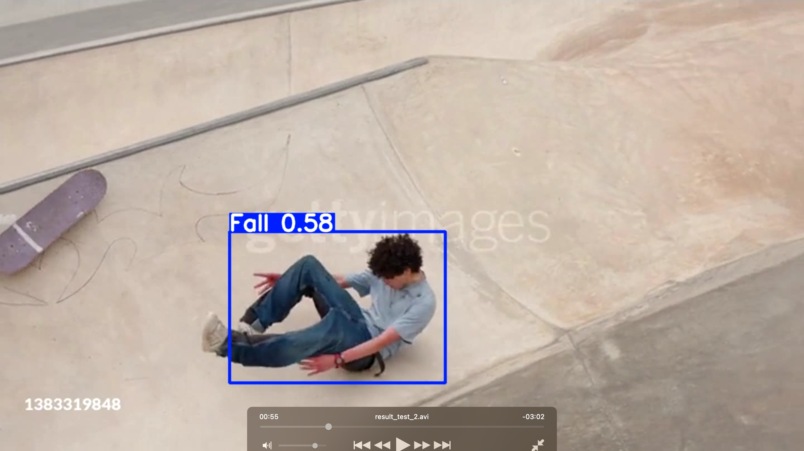
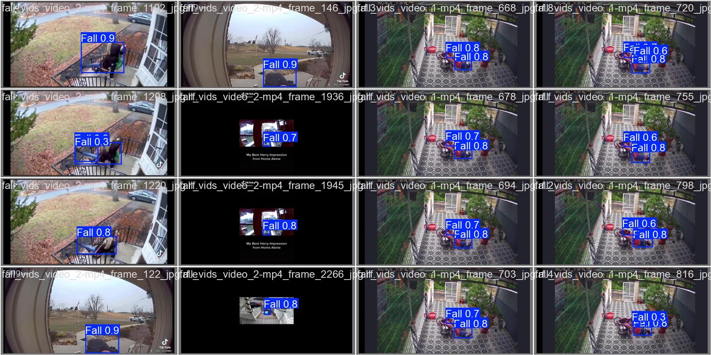
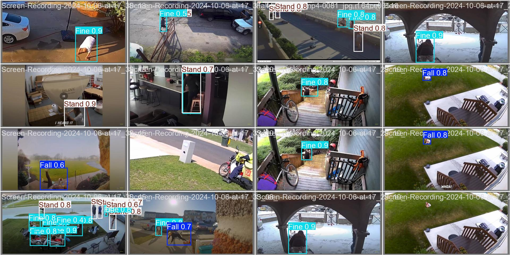
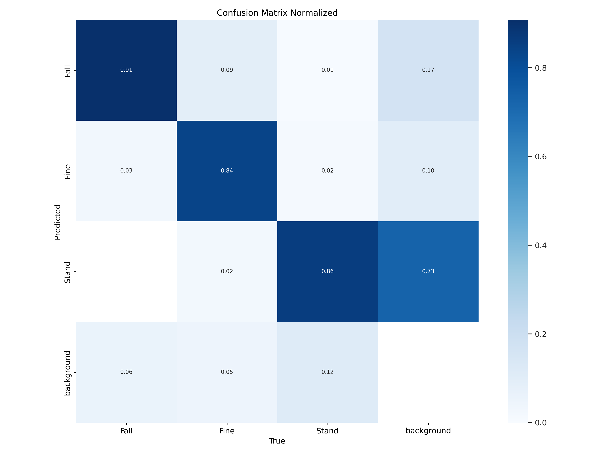
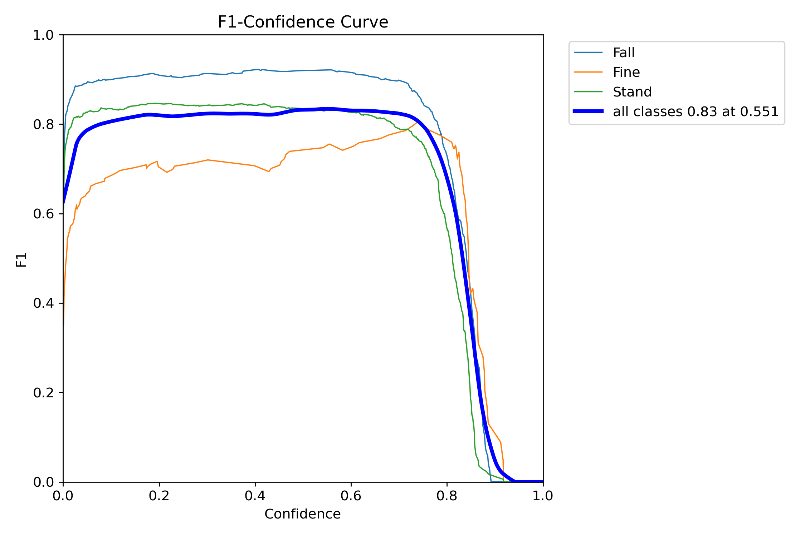
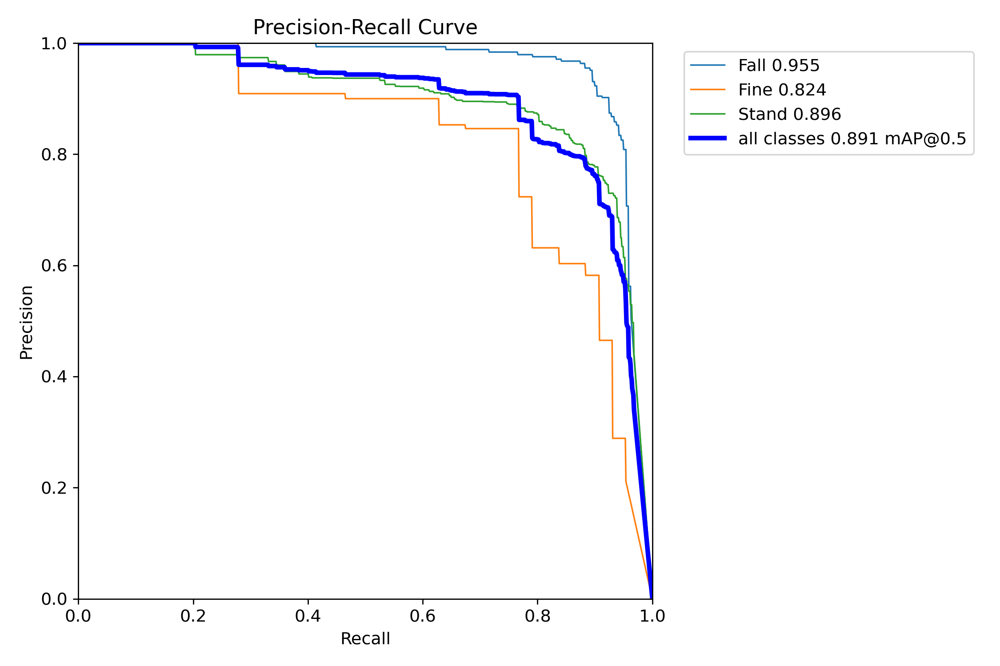
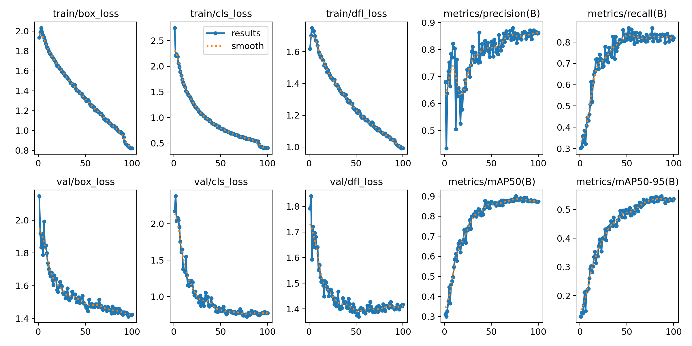

# 🤖 Welcome to my fall-detection-model documentation! 🤖

## About

This Model is designed to detect falls and sends an alert in real-time using a camera feed. It is built using [Roboflow Inference](https://inference.roboflow.com/) and trained on the latest [YOLOv11s](https://docs.ultralytics.com/models/yolo11/) model.

## Usage

This model could be used in two ways:

- **Local**: Run the model on your local machine using a video file.
- **RTSP**: Run the model on your local machine using a simulated RTSP stream.

**Click to expand each section for further details**

<details>
  <summary><strong><span style="font-size: 18px;">Local (Easier to run)</span></strong></summary>

### 1. Skip this step, if on `python --version` < 3.12

> (Roboflow inference currently does not work on python 3.12)

If you're using **pyenv**:

```bash
pyenv install --list
```

then install any python version < 3.12

```bash
pyenv install <Python_Version>
pyenv local <Python_Version>
```

If you're using **conda**:

```bash
conda activate my_env
conda install python=3.11.4
```

### 2. Install dependencies and run rtsp.py

```bash
pip install -r ./requirements.txt
python local.py
```

**Notes**

> If you encounter "dll load failed while importing \_cext the specified module could not be found", run the following command:
> `pip install msvc-runtime`

</details>

<details>
  <summary><strong><span style="font-size: 18px;">Simulate-RTSP</span></strong></summary>

### 1. Run MediaMtx depending on your system

```bash
cd mediamtx_linux
or
cd mediamtx_mac
or
cd mediamtx_windows

./mediamtx
```

### 2. Skip this step, if you already have ffmpeg in your system

> I provided the ffmpeg installation files for each system

Mac

```bash
brew install ffmpeg
```

Windows

```
https://www.wikihow.com/Install-FFmpeg-on-Windows
```

### 3. (New Terminal) Run ffmpeg command (Required ffmpeg to be installed)

```bash
ffmpeg -re -stream_loop -1 -i "./examples/fall_detection_1.mp4" -c copy -f rtsp rtsp://localhost:8554/mystream
```

### 4. (New Terminal) Skip this step, if on `python --version` < 3.12

> (Roboflow inference currently does not work on python 3.12)

If you're using **pyenv**:

```bash
pyenv install --list
```

then install any python version < 3.12

```bash
pyenv install <Python_Version>
pyenv local <Python_Version>
```

If you're using **conda**:

```bash
conda activate my_env
conda install python=3.11.4
```

### 5. Install dependencies and run rtsp.py

```bash
pip install -r ./requirements.txt
python rtsp.py
```

</details>

## Results Examples

---







## Model Performance

---






| Metric                        | Value   |
| ----------------------------- | ------- |
| f1@0.553 confidence threshold | 0.83    |
| mAP@0.5                       | 0.87236 |
| mAP@0.5:0.95                  | 0.53714 |
